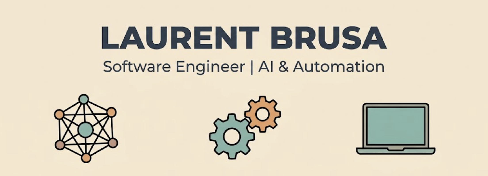

## About Me
I am a versatile Software Engineer who successfully transitioned from the airline industry into tech. With a strong foundation in **C/C++, Swift, and Python**, I enjoy bridging the gap between low-level systems and modern, interactive applications. 

Currently pursuing a specialization in **AI and Automation** at [42 Berlin](https://42berlin.de/), I thrive in agile environments, solving complex technical challenges, and building robust, highly performant solutions.

## Featured Projects

### Startups & Interactive Web
*   **[Jiffy Events](https://jiffy-events.com/share)** *(Co-Founder / CTO)*: An interactive real-time presentation platform featuring live polls and smartphone QR-pairing. 
*   **[gyro.games](https://gyro.games/)** *(Co-Founder / CTO)*: A seamless web multiplayer platform that utilizes mobile hardware sensors (gyroscope, accelerometer) as game controllers.

### Mobile Development
*  **[My iOS Portfolio](https://multitudes.github.io/portfolio/)**: Showcasing my professional work in Swift, ARKit, and SwiftUI, focusing on delightful and accessible user experiences.

### Systems, DevOps & Security (42 Berlin)
A deep dive into system architecture, networking, infrastructure, and cybersecurity:
*   [libftpp](https://github.com/multitudes/libftpp): Advanced C++ component library exploring design patterns, multi-threading, and client/server networking.
*   [Darkly (CTF)](https://github.com/multitudes/darkly-ctf): Web application security and vulnerability exploitation.
*   [IoT - Inception of Things](https://github.com/multitudes/IoT-Inception-of-Things-A-42-Project): Infrastructure and Kubernetes/K3s deployment.
*   [Inception](https://github.com/multitudes/42-inception): System administration and Docker deployment.
*   [Webserv](https://github.com/multitudes/httpwebserver): A custom HTTP server written in C++, with integration tests in Python.
*   [miniRT](https://github.com/multitudes/miniRayTracer): A raytracer built in C.
*   [Minishell](https://github.com/multitudes/42-minishell): A bash-like shell operating system written in C.

##  Tech Stack & Current Focus
*   **Core:** C, C++, Swift, Python
*   **DevOps:** Docker, GitHub CI/CD, Git, Linux
*   **Currently Exploring:** Local Agentic LLM deployments, AI integration, and low-level cybersecurity.

##  Let's Connect!
*   [LinkedIn](https://www.linkedin.com/in/laurentbrusa/)
*   [Mastodon](https://iosdev.space/@multitudes)
*   [Bluesky](https://bsky.app/profile/laurentbrusa.bsky.social)
*   [Hashnode](https://laurentbrusa.hashnode.dev)
*   [My Linktree](https://linktr.ee/laurentbrusa)

---

##  My Latest Blog Posts
<!-- BLOG-POST-LIST:START -->
- [Connecting Antigravity to Xcode](https://laurentbrusa.hashnode.dev/connecting-antigravity-to-xcode)
- [Notes about my SAP Masterclass - Agile Development in Practice](https://laurentbrusa.hashnode.dev/notes-about-my-sap-masterclass-agile-development-in-practice)
- [Answer by multitudes for Operator overloading not yet supported?](https://stackoverflow.com/questions/24148135/operator-overloading-not-yet-supported/78672928#78672928)
- [Answer by multitudes for Why is operator overloading in Swift not declared inside the type it belongs to?](https://stackoverflow.com/questions/25642085/why-is-operator-overloading-in-swift-not-declared-inside-the-type-it-belongs-to/78672910#78672910)
- [Code-Along Project With MapKit for SwiftUI - Part 6](https://laurentbrusa.hashnode.dev/code-along-project-with-mapkit-for-swiftui-part-6)
<!-- BLOG-POST-LIST:END -->
